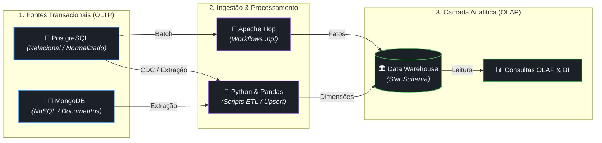

# 🚀 Data Engineering & Analytics Modernization


## 📌 Visão Geral Executiva

Este repositório consolida um projeto de **Engenharia de Dados de Ponta a Ponta**, focando na transição arquitetural de sistemas puramente operacionais (OLTP) para ecossistemas analíticos de alta performance (OLAP). O projeto resolve os desafios intrínsecos de migrar esquemas altamente normalizados num banco de dados relacional para modelos orientados a documentos em NoSQL, garantindo integridade referencial a nível de aplicação e pavimentando o caminho para um Data Warehouse corporativo, aplicando modelagem dimensional (Star/Snowflake Schema).

---

## 🏗️ Diagrama de Arquitetura



---

## 📂 Estrutura e Camadas do Projeto

### `01-relational-postgres/` (Camada Transacional OLTP RDBMS)
Contém a base fundacional do projeto operando sobre PostgreSQL. O modelo de dados original está na 3ª Forma Normal (3FN) focado em garantia de integridade transacional (ACID) em operações cotidianas do portal universitário.
- **Destaque Técnico:** Consultas complexas usando JOINs otimizados e gerenciamento de transações usando conectores robustos como `psycopg2`.

### `02-nosql-mongodb/` (Camada Operacional NoSQL)
Demonstra a migração e adaptação de um modelo relacional para um modelo orientado a documentos visando escalabilidade e alta flexibilidade (MongoDB).
- **Destaque Técnico:** Resolução do desafio de "impedance mismatch" entre o modelo tabular e documentos aninhados; implementação de integridade referencial a nível de aplicação via validações JSON Schema rigorosas; pipelines de `ETL.py` nativos para upserts idempotentes.

### `03-data-warehouse-etl/` (Camada Analítica DW & OLAP)
Foca no processamento e estruturação de dados analíticos. A modelagem aqui transita de OLTP para dimensional (Star Schema/Snowflake Schema) otimizada para leitura.
- **Destaque Técnico:** Pipelines de extração e transformação construídos com Pandas (`etl_pandas_dw.py`) e fluxos Apache Hop (`.hpl`); extração inteligente da base relacional consolidando dimensões como Professor, Disciplina, Semestre e tabela Fato Turma para respostas rápidas de BI.

### `docs/` (Documentação e Especificações)
Contém os diagramas, mapeamentos, regras de negócios e relatórios de execução das etapas de Engenharia e Arquitetura de Dados.

---

## ⚙️ Guia Completo de Execução

### 1. Clonar o Repositório
```bash
git clone https://github.com/seu-usuario/Engenharia-de-dados.git
cd Engenharia-de-dados
```

### 2. Configurar o Ambiente Virtual (venv)
É altamente recomendado isolar as dependências para não conflitar com pacotes do sistema:
```bash
python3 -m venv venv
source venv/bin/activate  # No Windows use: venv\Scripts\activate
```

### 3. Instalar Dependências Essenciais
```bash
pip install -r requirements.txt
```

### 4. Configurar as Variáveis de Ambiente
Copie o modelo de variáveis e ajuste com suas credenciais (As senhas hardcoded foram higienizadas para segurança do projeto em produção):
```bash
cp .env.example .env
```
> **Nota:** Edite o arquivo `.env` inserindo as credenciais corretas do seu cluster MongoDB Atlas e instância PostgreSQL local/RDS.

### 5. Executando os Módulos

**Módulo Relacional (PostgreSQL):**
```bash
cd 01-relational-postgres
# Certifique-se de que o banco PostgreSQL está rodando e execute a aplicação Flask
python app2.py
```

**Módulo NoSQL (MongoDB):**
```bash
cd 02-nosql-mongodb
# Se precisar rodar o pipeline de carga do MongoDB:
python ETL.py --apply
# Para iniciar o painel Web do MongoDB:
python app.py
```

**Módulo Data Warehouse (Pipelines Pandas/Hop):**
```bash
cd 03-data-warehouse-etl
# Execute o script ETL em Pandas para gerar os dados analíticos
python etl_pandas_dw.py
```

---
*Este projeto aplica as melhores práticas de Arquitetura de Software e Engenharia de Dados, possuindo credenciais protegidas e dependências bem definidas. Pronto para evoluir em ambientes de Produção.*
