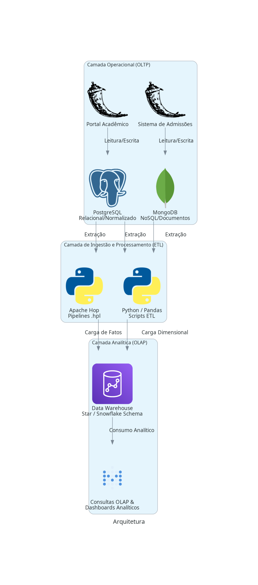

# Engenharia de Dados: PostgreSQL, MongoDB e Data Warehouse


Este repositório documenta a migração de um banco de dados relacional (OLTP) para um modelo orientado a documentos em NoSQL, seguida da estruturação de um Data Warehouse (OLAP). O projeto detalha a desnormalização de dados para o MongoDB, a manutenção de integridade referencial na camada de aplicação e a modelagem dimensional para consultas analíticas.

## Diagrama de arquitetura



## Estrutura do projeto e trade-offs

### `01-relational-postgres/`
Contém o banco PostgreSQL na 3ª Forma Normal (3FN), focado em consistência transacional (ACID). Inclui a aplicação Flask original (Portal Acadêmico).
- **Trade-off:** O modelo normalizado previne anomalias de atualização e garante integridade na escrita, mas exige múltiplos JOINs para leitura, impactando o tempo de resposta em agregações maiores.

### `02-nosql-mongodb/`
Implementa o banco orientado a documentos. Como o MongoDB não força chaves estrangeiras nativamente, a validação de integridade referencial foi movida para a aplicação via JSON Schema e lógica no Flask.
- **Trade-off:** A leitura é acelerada porque os dados acessados em conjunto são armazenados no mesmo documento, resolvendo o "impedance mismatch". Em contrapartida, as atualizações de dados duplicados exigem controle na aplicação e upserts idempotentes (`ETL.py`) para evitar inconsistências.

### `03-data-warehouse-etl/`
Contém a modelagem dimensional otimizada para leitura. O pipeline extrai dados do PostgreSQL e do MongoDB usando Pandas (`etl_pandas_dw.py`) e Apache Hop (`.hpl`), consolidando dimensões (Professor, Disciplina, Semestre) e a tabela Fato Turma.
- **Trade-off:** O processamento em batch adiciona latência entre o dado gerado na operação e o dado disponível para análise. No entanto, o isolamento em um Data Warehouse evita que consultas analíticas pesadas (BI) degradem a performance do banco transacional.

### `docs/`
Mapeamentos de esquema, decisões de modelagem e documentação de requisitos.

## Execução

### 1. Clonar o repositório
```bash
git clone https://github.com/seu-usuario/Engenharia-de-dados.git
cd Engenharia-de-dados
```

### 2. Configurar o ambiente
```bash
python3 -m venv venv
source venv/bin/activate  # Windows: venv\Scripts\activate
pip install -r requirements.txt
```

### 3. Configurar variáveis de ambiente
Crie o arquivo `.env` para informar as conexões de banco de dados (MongoDB Atlas e PostgreSQL):
```bash
cp .env.example .env
```

### 4. Executar os módulos

**PostgreSQL (Portal Acadêmico):**
```bash
cd 01-relational-postgres
python app2.py
```

**MongoDB (Sistema de Admissões e ETL):**
```bash
cd 02-nosql-mongodb
python ETL.py --apply
python app.py
```

**Data Warehouse:**
```bash
cd 03-data-warehouse-etl
python etl_pandas_dw.py
```
